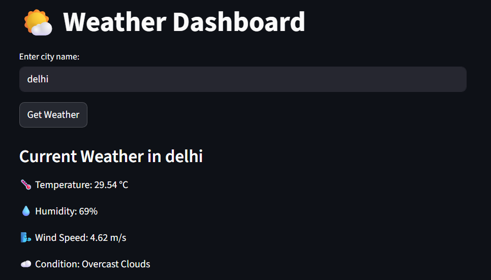

# 🌤️ Weather Dashboard

A simple and interactive **Weather Dashboard** built with **Streamlit** and **Python**.  
It allows users to check the **current weather conditions** and view a **5-day temperature forecast** for any city worldwide.  



---

## 🚀 Features
- 🌍 Search weather by **city name**
- 🌡️ Display **current temperature, humidity, wind speed, and condition**
- 📊 Interactive **5-day temperature forecast chart**
- 🎨 Dark-themed, modern **Streamlit UI**
- ⚡ Fast and responsive  

---

## 🛠️ Tech Stack
- **Python 3**
- **Streamlit** → UI and dashboard  
- **Requests** → Fetching weather data from API  
- **Matplotlib / Plotly** → Visualizing temperature trends  

---

## 📦 Installation

1. Clone the repository:
   ```bash
   git clone https://github.com/your-username/weather-dashboard.git
   cd weather-dashboard
   ```

2. Create a virtual environment (optional but recommended):

   ```bash
   python -m venv venv
   source venv/bin/activate   # On Mac/Linux
   venv\Scripts\activate      # On Windows
   ```

3. Install dependencies:

   ```bash
   pip install -r requirements.txt
   ```

---

## ⚙️ Usage

1. Run the Streamlit app:

   ```bash
   streamlit run app.py
   ```

2. Enter the **city name** in the input box.

3. Click **"Get Weather"** to view:

   * Current weather details
   * 5-day temperature forecast

---

## 📊 Example Output

**Current Weather in London**

* 🌡️ Temperature: 19.37 °C
* 💧 Humidity: 69%
* 🌬️ Wind Speed: 3.88 m/s
* ☁️ Condition: Light Rain

**5-Day Temperature Forecast**

* Interactive line chart showing upcoming temperature trends

---

## 🔑 API Key Setup

This app uses the **OpenWeatherMap API**.

1. Sign up at [OpenWeatherMap](https://openweathermap.org/api) and generate a free API key.
2. Open `app.py` and replace the placeholder with your API key:
3. Save the file and rerun the app.

---

## 📸 Screenshot

Here’s how the dashboard looks:


---

## 📝 Requirements

Create a `requirements.txt` file with:

```txt
streamlit
requests
matplotlib
plotly
```

Then install them:

```bash
pip install -r requirements.txt
```

---

## 🤝 Contributing

Pull requests are welcome! For major changes, open an issue first to discuss what you’d like to improve.

---

## 📜 License

This project is licensed under the **MIT License** – feel free to use and modify.
